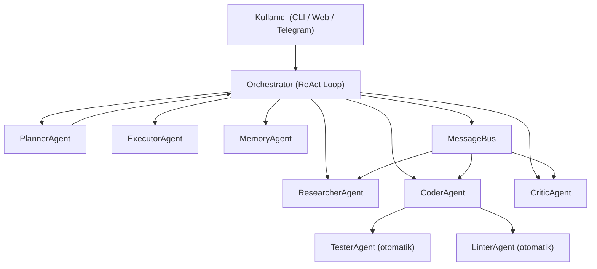

# 🤖 Multi-Agent Orchestration System — Detaylı Teknik Rapor

> **Hazırlanma Tarihi:** 3 Mart 2026  
> **Proje Konumu:** `c:\Users\ahmed\OneDrive\Masaüstü\Multi-Agent\multi_agent_system`  
> **Versiyon:** V5 (ReAct + Phased + Memory Agent + Human-in-the-Loop)

---

## 1. Yönetici Özeti

Bu proje, doğal dil ile verilen bir yazılım geliştirme hedefini (ör. *"Flask ile REST API yaz"*) tam otomatik olarak Python kaynak koduna dönüştüren çok ajanlı (multi-agent) bir orkestrasyon sistemidir. Sistem; planlama, araştırma, kod yazma, kod inceleme, test ve çalıştırma aşamalarını birbirinden bağımsız yapay zeka ajanlarına dağıtır. **OpenRouter** üzerinden çeşitli LLM modellere erişir ve kullanıcıya üç farklı arayüz sunar: terminal CLI, web (FastAPI + SSE) ve Telegram botu.

---

## 2. Genel Mimari



**Temel akış:**
1. Kullanıcı bir hedef girer
2. Orchestrator → PlannerAgent ile görevi alt görevlere böler (flat veya phased)
3. Bağımsız görevler **paralel**, bağımlı görevler **sıralı** çalışır
4. Her CoderAgent çalıştıktan sonra TesterAgent ve LinterAgent **otomatik** devreye girer
5. CriticAgent kod çıktısını değerlendirir, düşük skor → retry
6. MemoryAgent tüm oturumları kaydeder; gelecek çalışmalarda bağlam olarak kullanır
7. Sonuçta proje `workspace/projects/<slug>/` altında src, tests, docs olarak saklanır

---

## 3. Dizin Yapısı

```
multi_agent_system/
├── main.py                   # Giriş noktası (CLI, --demo, --profile)
├── requirements.txt          # Bağımlılıklar
├── .env / .env.example       # API anahtarları ve konfigürasyon
│
├── core/                     # Sistem kalbi
│   ├── base_agent.py         # Soyut BaseAgent sınıfı (339 satır)
│   ├── orchestrator.py       # Ana orkestratör (1179 satır)
│   ├── llm_client.py         # OpenRouter LLM istemcisi (311 satır)
│   ├── memory.py             # 2 katmanlı bellek sistemi (192 satır)
│   ├── memory_agent.py       # Kalıcı proje hafızası (V5)
│   ├── message_bus.py        # Ajanlar arası mesaj veriyolu
│   ├── cluster_manager.py    # 2 model yarışma modu
│   └── cluster_runner.py     # Cluster yönetimi
│
├── agents/                   # Uzman ajanlar (7 adet)
│   ├── planner_agent.py      # Hedef → görev planı (263 satır)
│   ├── researcher_agent.py   # DuckDuckGo web araştırması
│   ├── coder_agent.py        # Kod üretimi + auto-fix (810 satır)
│   ├── critic_agent.py       # Kod kalite değerlendirmesi
│   ├── executor_agent.py     # Kod çalıştırma + test
│   ├── linter_agent.py       # Flake8/Pylint entegrasyonu
│   ├── tester_agent.py       # pytest otomasyonu
│   └── profiler_agent.py     # Kullanıcı profil analizi (295 satır)
│
├── tools/                    # Yardımcı araçlar (13 dosya)
│   ├── file_manager.py       # Dosya okuma/yazma
│   ├── code_runner.py        # Sandbox Python çalıştırıcı
│   ├── git_manager.py        # Otomatik git commit
│   ├── web_search.py         # DuckDuckGo arama
│   ├── project_indexer.py    # Mevcut proje tarama
│   ├── project_templates.py  # Flask, FastAPI şablonları
│   ├── requirements_generator.py  # requirements.txt otomatik üretim
│   └── simple_search.py      # RAG bağlam arama
│
├── api/                      # FastAPI web sunucusu
│   ├── main_api.py           # REST + SSE endpoints (486 satır)
│   └── static/               # Mobil UI (index.html)
│
├── telegram_bot/             # Telegram entegrasyonu
│   └── bot.py                # Komutlar + ZIP çıktı (286 satır)
│
├── ui/                       # Terminal arayüzü
│   ├── cli.py                # Rich terminal UI (9059 byte)
│   └── dashboard.py          # Durum göstergesi
│
├── config/                   # Konfigürasyon
│   └── settings.py           # Model routing, token bütçesi, fiyatlandırma
│
└── workspace/                # Üretilen projeler (çalışma zamanı)
    └── projects/<slug>/
        ├── src/              # Üretilen Python kaynak dosyaları
        ├── tests/            # Test dosyaları
        ├── docs/             # Dokümantasyon
        └── session_*.json    # Oturum kayıtları
```

---

## 4. Core Katmanı — Detaylı İnceleme

### 4.1 BaseAgent (`core/base_agent.py`)

Tüm ajanların türediği soyut temel sınıf. Tasarım kalıbı olarak **Template Method Pattern** kullanılmış.

| Sınıf / Yapı | Açıklama |
|---|---|
| `Task` | Görev veri modeli: `task_id`, `description`, `assigned_to`, `dependencies`, `context`, `priority` |
| `ThoughtProcess` | `think()` çıktısı: muhakeme, plan adımları, araç çağrıları, güven skoru |
| `AgentResponse` | `act()` çıktısı: içerik, başarı durumu, hata, meta veri, öz değerlendirme |
| `AgentStatus` | `IDLE / THINKING / ACTING / WAITING / ERROR` enum |
| `BaseAgent.run()` | `think()` → `act()` → `_reflect()` döngüsü; her görev sonunda öz değerlendirme yapar |
| `_call_llm()` | LLMClient wrapper; token takibini günceller |
| `_parse_json_response()` | Markdown fences kaldırarak JSON parse eder |

**Öz yansıma (self-reflection):** Her görev tamamlandıktan sonra ajan kendi çıktısını eleştirel bir bakışla değerlendirir (150 token, temperature=0.3). Bu, çıktı kalitesini artıran önemli bir mekanizmadır.

### 4.2 Orchestrator (`core/orchestrator.py`, 1179 satır)

Sistemin beyni. Tüm ajanları orkestre eden, ReAct loop'u yöneten ve hata yönetimini gerçekleştiren merkezi bileşen.

**Temel özellikler:**

| Özellik | Detay |
|---|---|
| **ReAct Loop** | Reason → Act → Observe döngüsü, max 10 iterasyon |
| **Phased Execution** | Büyük projeler fazlara bölünür; her faz önceki fazın dosyalarını bağlam olarak alır |
| **Paralel Çalıştırma** | Bağımsız görevler `asyncio.gather()` ile eş zamanlı çalışır |
| **Bağımlılık yönetimi** | `task.dependencies` ve `context["depends_on"]` kontrol edilir |
| **Context Sıkıştırma** | Her ajan tipi için sadece ilgili bağlam filtrelenir (token tasarrufu) |
| **Auto-retry** | Başarısız görevler max 3 kez yeniden denenir; hata tipine göre `fix_hint` eklenir |
| **Git entegrasyonu** | Her başarılı görev sonrası ve proje bitişinde otomatik commit |
| **Cluster Mode** | 2 farklı model aynı görevi çalıştırır, CriticAgent kazananı seçer |
| **Human-in-the-Loop (V5)** | Plan önizleme: kullanıcı onayı alındıktan sonra çalıştırma |

**Context Filtreleme Kuralları:**
- `planner` → Sadece kullanıcı hedefi
- `researcher` → Planner çıktısı özeti
- `coder` → Research bulgular + mevcut dosya listesi + critic geri bildirimi
- `critic` → Sadece incelenecek kod
- `executor` → Sadece dosya adı/komutlar

### 4.3 LLM İstemcisi (`core/llm_client.py`)

**OpenRouter** altyapısı üzerinden birden fazla LLM'e erişimi yöneten async istemci.

| Bileşen | Açıklama |
|---|---|
| `RateLimiter` | 50 istek/10 saniye pencere, aşımda bekler |
| `TokenUsage` | Per-agent token ve maliyet takibi |
| `LLMClient.complete()` | Normal tamamlama, max 3 retry, exponential backoff |
| `LLMClient._stream_complete()` | SSE streaming (web arayüzü için) |
| Per-agent output limit | `TOKEN_BUDGET` ile her ajan için ayrı max_tokens sınırı |
| Dual-provider | OpenRouter + Groq desteği, config'den seçilebilir |

**Fiyatlandırma:** Token başına maliyet `config/settings.py`'deki `PRICING` sözlüğünden alınır ve her çağrı sonrası `$cost` formatında loglanır.

### 4.4 İki Katmanlı Bellek (`core/memory.py`)

| Bellek Tipi | Yapı | Kapsam |
|---|---|---|
| **ShortTermMemory** | Per-agent deque (max 10 etkileşim) | Anlık konuşma bağlamı |
| **LongTermMemory** | Asyncio lock korumalı JSON key-value | Disk'e kalıcı, ajanlar arası paylaşımlı |
| **MemoryManager** | İki katmanı birleştiren singleton | `session_*.json` oturum kayıtları |

---

## 5. Agent Katmanı — Detaylı İnceleme

### 5.1 PlannerAgent (263 satır)

**Görev:** Kullanıcı hedefini JSON formatında alt görevlere böler.

- **Flat mod:** 1-3 özellikli küçük projeler için düz görev listesi
- **Phased mod:** 4+ özellikli projeler için fazlara bölünmüş plan
- **Retry mekanizması:** JSON parse başarısız olursa max 3 deneme, her denemede daha güçlü JSON zorunluluk ifadesi
- **Kurallar:** Executor'a yalnızca input almayan görevler; pytest ve PEP8 kontrolünü Tester/Linter üstlenir
- **Sıcaklık:** 0.3 (tutarlı JSON üretimi için düşük)

### 5.2 CoderAgent (810 satır) — En Karmaşık Ajan

**Görev:** Python kodu yazar, kaydeder, syntax kontrolü yapar ve hataları otomatik düzeltir.

**[FILE:...][/FILE] format sistemi:** JSON'un Python kodu içindeki özel karakterlerle bozulma sorununu çözer. 3 farklı format tanır:
1. `[FILE:dosya.py]...[/FILE]` (birincil)
2. ` ```python # dosya.py ... ` ` ` (fallback)
3. ` ```dosya.py ... ` ` ` (fallback)

**Auto-fix zinciri (sırayla uygulanır):**

| Adım | Açıklama |
|---|---|
| 1. Truncation tespiti | String dengesi, parantez dengesi, triple-quote kontrolü |
| 2. Regex auto-fix | `if b == :` → `if b == 0:` gibi yaygın syntax hataları |
| 3. Unterminated string fix | AST parse ile hatalı satır bulunur, tırnak eklenir |
| 4. `py_compile` syntax check | Gerçek Python derleyici ile doğrulama |
| 5. LLM syntax fix (max 2 deneme) | Hata mesajıyla birlikte LLM'e düzeltme yaptırılır |
| 6. Kaydetmeme kararı | Hata düzeltilemezse dosya kaydedilmez |

**Dosya organizasyonu:**
- `test_*.py` → `tests/` klasörü
- `*.html`, `*.jinja2` → `src/templates/`
- `*.css`, `*.js` → `src/static/`
- Diğer `.py` → `src/`

**Yasaklı dosya isimleri:** `output.py`, `script.py`, `temp.py`, `code.py`, `result.py`, `main_output.py`

### 5.3 CriticAgent

**Görev:** CoderAgent çıktısını değerlendirir; `CONFIDENCE_THRESHOLD = 0.6` altındaysa retry tetikler.

- Sadece coder çıktıları değerlendirilir (Researcher hariç — token optimizasyonu)
- Cluster modunda iki farklı model çıktısından kazananı seçer
- Critic skorları session'a kaydedilir, ortalama hesaplanır

### 5.4 ResearcherAgent

**Görev:** DuckDuckGo ile web araştırması yapar, kullanılacak kütüphaneler ve yaklaşımlar hakkında bilgi toplar.

- Kod yazmaz, sadece araştırma metni üretir
- Coder'ın `task.context["research"]` alanına eklenir

### 5.5 ExecutorAgent

**Görev:** Mevcut dosyaları çalıştırır veya test eder.

> [!IMPORTANT]
> Executor, `input()` alan veya `while True` döngüsü içeren betikleri çalıştıramaz. Bu sınırlama PlannerAgent'ın system prompt'unda belgelenmiştir.

### 5.6 TesterAgent & LinterAgent (V4)

- **TesterAgent:** pytest'i otomatik çalıştırır; başarısız testleri CoderAgent'a bildirir
- **LinterAgent:** Flake8/Pylint kontrolü; düşük skor → CoderAgent yeniden devreye girer

**Bu iki ajan kullanıcının görev listesine eklenmez; Orchestrator'ın `_execute_task()` metodu tarafından CoderAgent tamamlandığında otomatik tetiklenir.**

### 5.7 ProfilerAgent (295 satır)

**Görev:** Tüm workspace session verilerini okur, LLM ile kullanıcı profilini çıkarır ve `user_profile.txt` olarak kaydeder.

`python main.py --profile` komutu ile çalışır. Çıktı şunları içerir:
- Teknik seviye
- İlgi alanları, tercih edilen diller/araçlar
- Proje geçmişi tablosu
- Gelişim önerileri

---

## 6. Tools Katmanı

| Araç | Dosya | Açıklama |
|---|---|---|
| Dosya yönetimi | `file_manager.py` | Okuma, yazma, proje dizini oluşturma |
| Kod çalıştırma | `code_runner.py` | Sandbox Python çalıştırıcı (timeout korumalı) |
| Docker | `docker_runner.py` | İzole container çalıştırma |
| Git | `git_manager.py` | `init_repo`, `commit`, `revert_last` |
| Web arama | `web_search.py` + `simple_search.py` | DuckDuckGo + RAG bağlam araması |
| Proje indexleme | `project_indexer.py` | `/open` komutu için mevcut kod tarama |
| Şablonlar | `project_templates.py` | Flask, FastAPI, CLI proje yapıları |
| Requirements | `requirements_generator.py` | Import analizinden `requirements.txt` üretimi |
| Araç kaydı | `tool_registry.py` | Merkezi araç kayıt sistemi |

---

## 7. API Katmanı (FastAPI)

**Başlatma:** `uvicorn api.main_api:app --host 0.0.0.0 --port 8000`  
**Erişim:** PC'de `localhost:8000`, aynı ağdaki Android telefonda `http://<PC_IP>:8000`

### Endpoint'ler

| Method | Endpoint | Açıklama |
|---|---|---|
| `GET` | `/` | Mobil HTML arayüzü |
| `GET/POST` | `/login` | Cookie tabanlı oturum açma |
| `POST` | `/run` | Hedefi arka planda başlat, `session_id` döndür |
| `GET` | `/stream/{id}` | SSE canlı log akışı |
| `GET` | `/sessions` | Tüm oturumları listele |
| `GET` | `/projects` | Workspace projelerini listele |
| `GET` | `/project/{slug}/summary` | `project_summary.txt` içeriği |
| `GET` | `/download/{slug}` | Projeyi ZIP olarak indir |
| `POST` | `/plan` | Plan üret (çalıştırmadan) |
| `POST` | `/run-with-plan` | Onaylı planı SSE ile çalıştır |
| `GET` | `/memory` | Kayıtlı projeleri listele |
| `POST` | `/memory/search` | Hedefe göre ilgili proje ara |
| `GET` | `/health` | Sağlık kontrolü |

**Güvenlik:** `WEB_PASSWORD` (must be set in .env) cookie ile korunuyor. `AuthMiddleware` her request'te kontrol eder.

---

## 8. Telegram Bot

**Özellikler:**
- Güvenlik: Sadece sabit kodlanmış `ALLOWED_USER_ID` erişebilir (Ahmed'in ID'si)
- `/start`, `/status`, `/projeler` komutları
- Mesaj → Orchestrator → Canlı güncelleme (her 3 log mesajında Telegram mesajı güncellenir)
- Tamamlanan projeyi **ZIP dosyası olarak** doğrudan Telegram'a gönderir
- Memory Agent ile son 5 projeyi gösterir

---

## 9. Çalışma Modları

| Mod | Komut | Açıklama |
|---|---|---|
| **İnteraktif CLI** | `python main.py` | Rich terminal, komut geçmişi |
| **Tek hedef** | `python main.py "hedef"` | Non-interactive, doğrudan çalıştırma |
| **Demo** | `python main.py --demo` | Hacker News demo senaryosu |
| **Profil** | `python main.py --profile` | Kullanıcı profil analizi |
| **Web UI** | `uvicorn api.main_api:app` | FastAPI + mobil arayüz |
| **Telegram** | `python telegram_bot/bot.py` | Telegram üzerinden kontrol |
| **Cluster** | `CLUSTER_MODE=true` + `python main.py` | 2 model yarışır, iyi olanı seçilir |

**CLI özel komutları:**
- `/open <yol>` — Mevcut projeyi yükler (RAG bağlamı eklenir)
- `/plan <hedef>` — Planı önizle (V5 Human-in-the-Loop)
- `/memory` — Önceki projeleri göster
- `/profile` — Kullanıcı profili oluştur

---

## 10. Konfigürasyon (`config/settings.py`)

- **MODEL_ROUTING:** Her ajan için hangi LLM modeli kullanılacağını belirler
- **TOKEN_BUDGET:** Model başına max input/output token sınırları ve per-agent sınırlar
- **PRICING:** Token başına maliyet (input/output)
- **PROVIDER_CONFIG:** OpenRouter ve Groq bağlantı bilgileri

**Desteklenen provider'lar:** OpenRouter (gpt-4o, claude, qwen, deepseek vb.) + Groq

---

## 11. Proje Çıktı Yapısı

Her çalıştırma şu çıktıları üretir:

```
workspace/projects/<slug>/
├── src/
│   ├── main.py          # Ana uygulama kodu
│   ├── database.py      # Veritabanı modülleri
│   └── ...
├── tests/
│   └── test_main.py     # pytest test dosyaları
├── docs/
├── plan.json            # Planner çıktısı
├── project_summary.txt  # Okunabilir proje raporu
├── requirements.txt     # Otomatik üretilen bağımlılıklar
└── session_<ts>.json    # Oturum istatistikleri (token, maliyet, skor)
```

---

## 12. Güçlü Yönler

| Alan | Değerlendirme |
|---|---|
| **Modüler Mimari** | Her ajan bağımsız, yeni ajan eklemek sadece `BaseAgent` türetmek |
| **Hata Toleransı** | 3 katmanlı retry (agent level, task level, syntax fix) |
| **Token Verimliliği** | Context filtreleme ile gereksiz token harcaması önlenir |
| **Çok Arayüz** | CLI + Web (SSE) + Telegram aynı Orchestrator üzerinde |
| **Hafıza Sistemi** | Önceki projelerden öğrenme, bağlam aktarımı |
| **Kalite Güvencesi** | Tester + Linter + Critic otomatik zinciri |
| **Git versiyonlama** | Her ajan adımı otomatik commit |
| **Cluster Modu** | İki model yarıştırarak en iyisini seçme |

---

## 13. Geliştirilmesi Önerilen Alanlar

> [!TIP]
> Aşağıdaki alanlar projeyi daha güçlü yapabilir:

1. **Docker Sandbox Güçlendirme:** `docker_runner.py` mevcut ama Executor'a tam entegre değil. Üretilen kodun izole container'da çalıştırılması güvenliği artırır.

2. **Gerçek RAG Sistemi:** `simple_search.py` kelime eşleşmesine dayanıyor. Embedding tabanlı (ChromaDB, FAISS) bir RAG vektör veritabanı daha iyi bağlam bulur.

3. **Web Arayüzü Modernizasyonu:** `index.html` tek dosyada gömülü; ayrı bir React/Vue bağımsız frontend geliştirilmesi okunabilirliği artırır.

4. **Telegram Güvenlik:** `ALLOWED_USER_ID` sabit kodlanmış. `.env` dosyasına taşınması daha iyi pratik.

5. **Executor Sınırlaması:** `input()` alan programlar çalıştırılamıyor; gelecekte interaktif program desteği için mock stdin geliştirilebilir.

6. **Test Coverage:** Mevcut test dosyaları (test_onysoft.py, test_security.py) sınırlı. Orkestratör için unit/integration testler yazılabilir.

7. **Linter Skoru Threshold:** Şu an alt limit yok; konfigürasyon dosyasında minimum Pylint skoru `MIN_LINT_SCORE` olarak tanımlanabilir.

---

## 14. Teknik İstatistikler

| Metrik | Değer |
|---|---|
| Toplam Python kaynak dosyası | ~35+ |
| En büyük dosya | `orchestrator.py` (1179 satır, 53 KB) |
| İkinci büyük | `coder_agent.py` (810 satır, 37 KB) |
| Bağımlılık sayısı | 9 paket |
| Desteklenen arayüz sayısı | 3 (CLI, Web, Telegram) |
| Max paralel görev | Teorik sınırsız (`asyncio.gather`) |
| Max iterasyon | 10 (ReAct loop) |
| Max retry per task | 3 |
| Rate limit | 50 istek/10 saniye |
| LLM timeout | 120 saniye |

---

## 15. Bağımlılıklar

| Paket | Amaç |
|---|---|
| `httpx >= 0.27` | Async HTTP istemcisi (OpenRouter API) |
| `python-dotenv >= 1.0` | .env dosyası yönetimi |
| `pydantic >= 2.5` | Veri doğrulama |
| `rich >= 13.7` | Terminal zengin UI |
| `duckduckgo-search >= 5.3` | API anahtarı gerektirmeyen web araması |
| `pytest >= 8.0` + `pytest-asyncio` | Test çerçevesi |
| `aiofiles >= 23.2` | Async dosya işlemleri |
| `python-telegram-bot >= 20.0` | Telegram bot SDK |
| `fastapi` + `uvicorn` | Web API (requirements'ta eksik, kullanımda var) |

> [!WARNING]
> `fastapi` ve `uvicorn` `requirements.txt` dosyasında listelenmemiş. Web arayüzü kullanılıyorsa bu paketlerin kurulu olması gerekir.

---

*Bu rapor, projenin tüm kaynak dosyaları ve belgeleri incelenerek hazırlanmıştır.*
